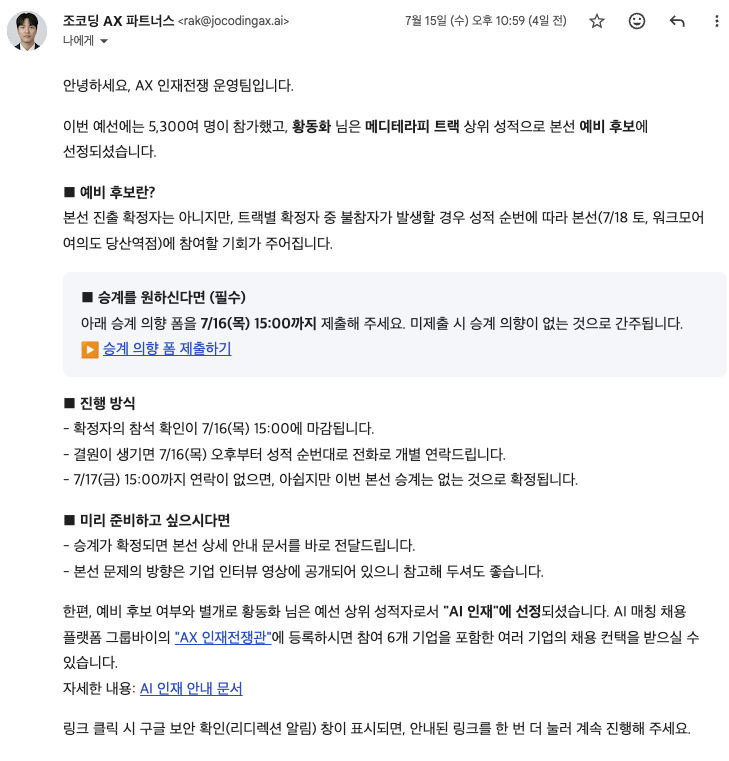

# MediInsight — 메디테라피 Codex 플러그인

> AX 인재전쟁 · MediTherapy Track · Codex Plugin

공개된 화장품 판매 채널의 고객 목소리를 모아, 근거 기반 한글 인사이트 리포트·인스타그램 컷툰·제품 소개 이미지·광고 문구 법률 검토까지 한 번에 만드는 Codex 플러그인입니다.

API 키 없이도 동작합니다. 동적 페이지는 설치된 Chrome으로 캡처하고, 이미지 텍스트는 Codex VLM으로 읽고, 내장 `mediinsight-law` MCP로 화장품 광고 리스크를 사전 검토합니다.

---

## AX 인재전쟁 성과

5,300명 이상이 참가한 **AX 인재전쟁** 예선에서 **메디테라피 트랙 결선 예비 후보**로 선정되었고, 상위 성적으로 **AI 인재**에 지정되었습니다. AI 인재는 AI 채용 플랫폼 [Groupby](https://groupby.kr)의 AX 인재전쟁 인재관에 등록되어 참가 기업 등으로부터 채용 연락을 받을 수 있습니다.



---

## 관련 프로젝트

같은 AX 해커톤에서 만든 마이리얼트립 Codex 플러그인도 있습니다.

| 저장소 | 트랙 | 한 줄 소개 |
| --- | --- | --- |
| **이 저장소** (`hackerton-ax-meditherapy`) | 메디테라피 | 공개 리뷰 → 인사이트 리포트 · 컷툰 · 광고 컴플라이언스 |
| [hackerton-ax-myrealtrip](https://github.com/Fhwang0926/hackerton-ax-myrealtrip) | 마이리얼트립 | 공개 신호 → 주간 캠페인 리포트 · SNS 초안 |

[마이리얼트립 Weekly Campaign Copilot](https://github.com/Fhwang0926/hackerton-ax-myrealtrip)은 마케팅·MD 팀이 **「이번 주 어떤 여행 상품을 밀까?」**를 공개 데이터로 빠르게 판단하도록 돕습니다. 뉴스·환율·날씨 등 공개 신호를 모아 추천 여행지와 근거를 만들고, 인스타그램·페이스북·네이버 블로그 초안과 HTML 리포트까지 생성합니다.

```text
Collector → Normalizer → Trend Engine → Campaign Planner → Content Generator → HTML Report
```

설치·실행 방법은 해당 저장소 README를 참고하세요.

```bash
codex plugin marketplace add marketplace
codex plugin add myrealtrip-weekly-campaign-copilot@hackathon-local
```

---

## 제출용 플러그인 안내

실행 가능한 플러그인 소스는 `src/`에 있습니다.

`output/`, `logs/`, `submission.zip`은 로컬 실행·제출 패키징 결과물이므로 Git에는 올리지 않습니다. 제출용 zip은 `scripts/build_submission.py`로 생성합니다.

---

## 무엇을 해결하나요?

메디테라피 제품은 자사몰, 화해, 올리브영 등 여러 채널에 리뷰가 흩어져 있습니다. 수집 → 정리 → 인사이트 → 콘텐츠 → 법률 검토가 대부분 수작업이라, 고객 목소리를 마케팅 자산으로 바꾸기 어렵습니다.

MediInsight는 이 흐름을 자동화합니다.

```text
Evidence → Insight → Content → Compliance
```

| 산출물 | 설명 |
| --- | --- |
| 한글 리포트 | `report/index.html`, `mediinsight_report.md` |
| 컷툰 3장 | 스토리 연결 4컷 웹툰 PNG (`carousel_01`~`03`) |
| 제품 소개 1장 | `product_ad.png` |
| 컴플라이언스 | Law MCP 검토 · 근거 링크 · 위험 문구 격리 |

---

## 첫 사용: 상품 URL 저장

URL은 워크스페이스별 `.mediinsight/projects.json`에 저장됩니다. 한 번 저장하면 이후에는 프로젝트 이름만으로 재사용합니다.

```bash
cd src
python3 scripts/mediinsight_pipeline.py project save \
  --name meditherapy-pdrn \
  --product-name "메디테라피 PDRN 스킨부스터 세럼" \
  --channel official=https://meditherapy.co.kr/... \
  --channel hwahae=https://www.hwahae.co.kr/...
```

상태 파일은 사용자/워크스페이스 상태이므로 Git에 포함하지 않습니다.

---

## 전체 실행

저장소에는 브라우저로 검증한 PDRN 상품 입력과 생성 결과가 포함되어 있습니다.

```bash
cd src
python3 scripts/mediinsight_pipeline.py run \
  --project meditherapy-pdrn \
  --input examples/meditherapy_real_input.json \
  --out ../output/real-run
```

`run` 한 번으로 공개 페이지 캡처, Crema·Schema.org 리뷰 수집, 중복 제거, 한글 인사이트, 스토리보드, Law MCP 검토, 공식 출처 도달성 확인, 수정 재생성, 자산 격리를 수행합니다.

- imagegen은 글자 없는 만화 배경을 만들고, 렌더러가 검토된 한글 문구를 이후에 올립니다.
- 기본으로 공개 리뷰 페이지를 최대 2장 수집합니다. 더 넓게 보려면 입력에 `"max_review_pages": 3`을 넣으세요.
- 리뷰 미디어 URL은 `evidence/review_media_manifest.json`에 기록되며, 사진으로 피부 진단·효능을 단정하지 않습니다.
- 검증된 고객 리뷰가 없으면 샘플로 대체하지 않고 생성을 중단합니다.
- 데모 픽스처는 `--allow-demo`가 있을 때만 사용합니다.

---

## 스토리보드 · 이미지 생성

`run`이 근거 기반 한글 스토리보드와 이미지에 넣을 문구를 만듭니다. 최종 비주얼은 Codex imagegen에 생성된 프롬프트를 넘기면 됩니다.

```text
$mediinsight 저장된 meditherapy-pdrn 프로젝트를 분석하고,
storyboards.json을 바탕으로 한글 문구가 들어간 컷툰 4컷 이미지 3장과
마지막 제품 소개 이미지 1장을 만들어줘.
각 이미지의 문구는 Law MCP 검토 결과를 반영하고,
같은 인물과 분위기로 스토리가 이어지게 해줘.
```

재현용 비주얼 입력 예시:

```bash
cd src
python3 scripts/mediinsight_pipeline.py run \
  --project meditherapy-pdrn \
  --input examples/meditherapy_visual_input.json \
  --out ../output/real-run
```

확인 파일: `../output/real-run/report/index.html` 과 `../output/real-run/instagram/` 의 PNG 4장.

---

## 포함 샘플 결과

2026-07-10에 저장된 프로젝트로 생성·검증한 메디테라피 PDRN 샘플입니다.

```text
src/examples/outputs/meditherapy-pdrn/
├── carousel_01.png
├── carousel_02.png
├── carousel_03.png
├── product_ad.png
└── README.md
```


- 공개 리뷰 12건 · 채널 2개 (`meditherapy_official_pdrn`, `hwahae_pdrn`) · 중복 없음
- 원본 상품 이미지의 `불만족시 100% 환불보장` 문구는 Law MCP가 플래그 → 최종 `product_ad.png`는 깨끗한 생성 히어로 이미지를 사용

재사용 가능한 imagegen 배경·히어로 자산:

```text
src/examples/assets/meditherapy-pdrn/
```

---

## Codex에서 사용하기

설치 후 새 스레드에서 자연어로 요청하면 됩니다.

```text
$mediinsight
저장된 meditherapy-pdrn 프로젝트의 공개 리뷰를 다시 수집하고,
한글 보고서와 컷툰 4컷 이미지 3장, 제품 소개 이미지 1장을 만들어줘.
결과물은 output/real-run에 저장하고 report/index.html도 열어줘.
```

판매 채널만 추가할 때:

```text
$mediinsight
저장된 meditherapy-pdrn에 올리브영 상품 링크를 외부 채널로 추가하고
기존 공식몰 링크와 함께 다시 분석해줘.
```

프로젝트는 이름으로 병합됩니다. 기존 URL은 유지되고, 새로 준 채널만 추가·갱신됩니다.

---

## 출력 구조

```text
output/real-run/
├── captures/
├── evidence/
│   ├── raw_evidence.json
│   ├── evidence.json
│   ├── collection_stats.json
│   └── review_media_manifest.json
├── report/
│   ├── mediinsight_report.md
│   ├── index.html
│   ├── metrics.json
│   └── insights.json
├── compliance/
│   ├── pending_claims.json
│   ├── risk_findings.json
│   ├── before_after.json
│   ├── compliance_report.md
│   ├── asset_decisions.json
│   └── source_verification.json
├── run/
│   └── resolved_input.json
├── run_manifest.json
└── instagram/
    ├── carousel_01.png
    ├── carousel_02.png
    ├── carousel_03.png
    ├── product_ad.png
    ├── storyboards.json
    ├── imagegen_prompts.json
    ├── caption.md
    └── hashtags.md
```

---

## 플러그인 구조

```text
src/
├── .codex-plugin/plugin.json
├── .mcp.json
├── mcp/mediinsight_law_server.py
├── skills/mediinsight/
├── scripts/mediinsight_pipeline.py
├── mediinsight/
└── examples/
```

---

## 제출 패키지

원본 AI 대화 로그를 `logs/`에 넣은 뒤:

```bash
python3 scripts/build_submission.py
```

`src/`, 이 README, `logs/`를 담은 `submission.zip`을 만듭니다. `logs/`에 README만 있으면 zip 생성을 거부합니다.
