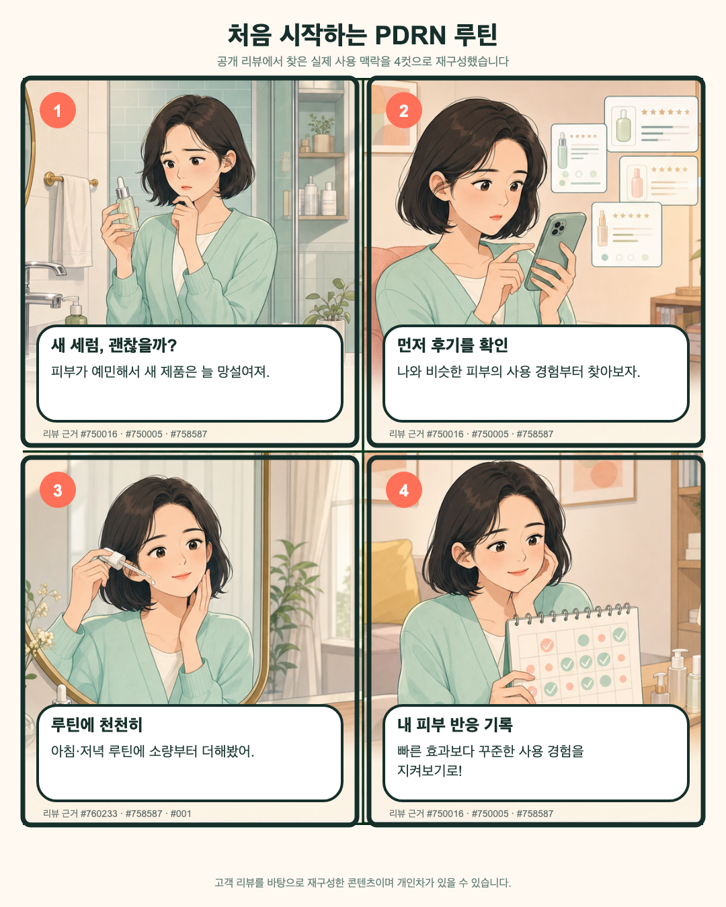
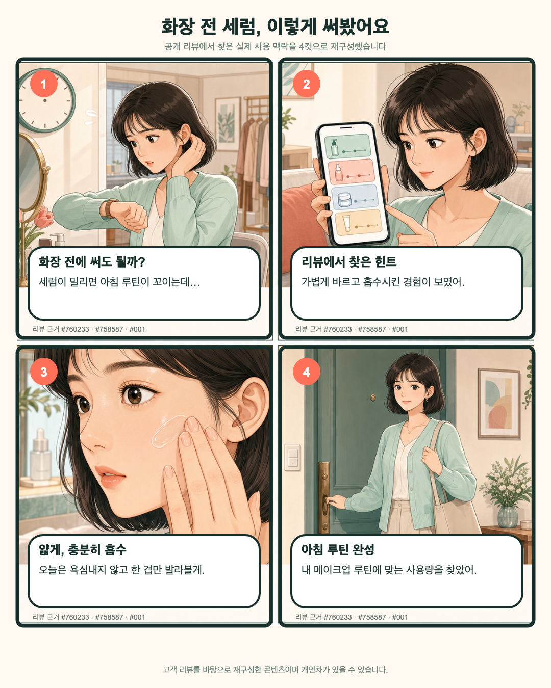
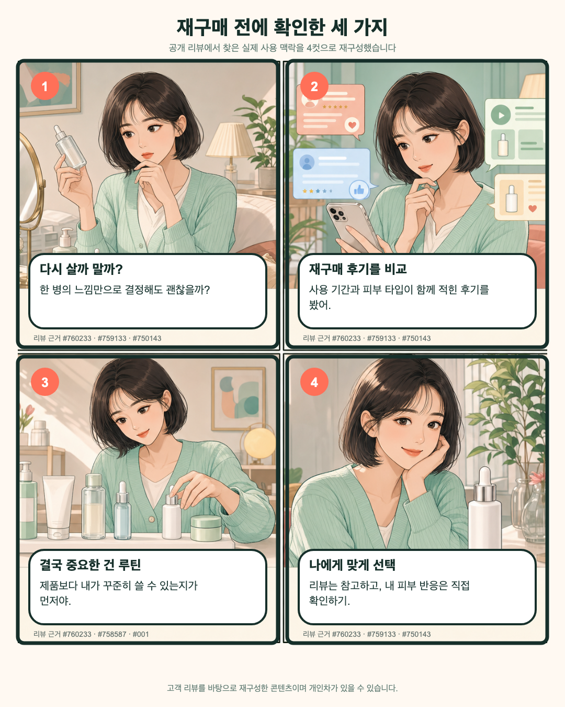
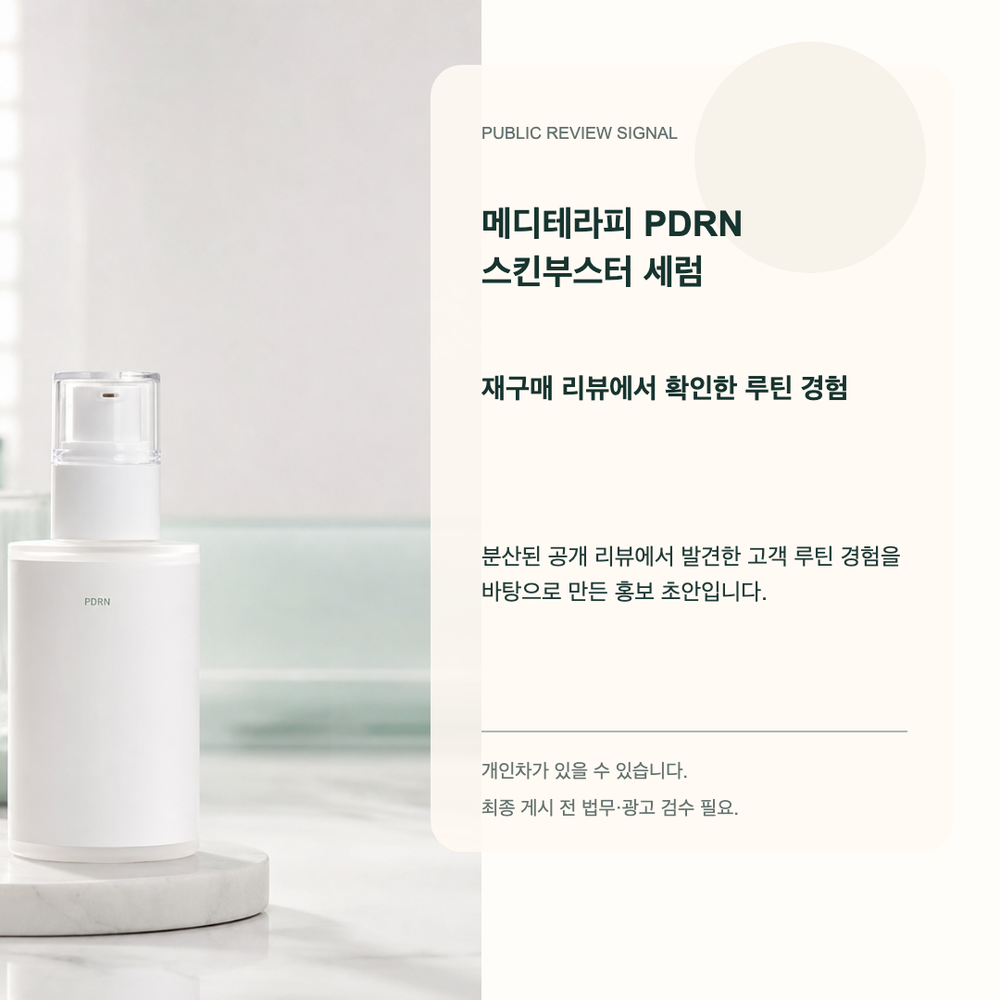

# MediInsight Codex Plugin

MediInsight converts real public Meditherapy customer voice into an easy-to-read Korean report, three story-driven four-panel webtoon PNGs, one product introduction PNG, and a Korean cosmetic-advertising review.

It does not require a private API key. Dynamic pages are captured with an installed Chrome browser, image text is supplied by Codex VLM during the skill workflow, and the bundled `mediinsight-law` MCP provides preliminary claim review with official source links.

## First use: remember the product URLs

URLs are stored per workspace in `.mediinsight/projects.json`. Once saved, later runs reuse them by project name, so the user does not need to repeat the official-store and external-marketplace links.

```bash
cd src
python3 scripts/mediinsight_pipeline.py project save \
  --name meditherapy-pdrn \
  --product-name "메디테라피 PDRN 스킨부스터 세럼" \
  --channel official=https://meditherapy.co.kr/... \
  --channel hwahae=https://www.hwahae.co.kr/...
```

The state file is intentionally excluded from Git because it is user/workspace state, not plugin source.

## Complete run

The repository includes a browser-verified PDRN product input and generated result:

```bash
cd src
python3 scripts/mediinsight_pipeline.py run \
  --project meditherapy-pdrn \
  --input examples/meditherapy_real_input.json \
  --out ../output/real-run
```

`run` performs public page capture, automatic rendered Crema and Schema.org review collection, duplicate removal, Korean insight generation, storyboard creation, bundled MCP compliance review, official citation reachability checks, corrected regeneration and asset quarantine in one command. Imagegen creates text-free comic art; the renderer overlays the Korean copy after compliance review so the final text stays readable. `run_manifest.json` records each stage and data-quality warnings.

The runtime collects up to two public review pages by default. Set `"max_review_pages": 3` in the input when a broader sample is needed. Review media URLs are written to `evidence/review_media_manifest.json` for controlled Codex VLM inspection; the runtime never claims to diagnose skin or verify efficacy from a photo.

Each review excerpt includes its public URL, capture time and browser provenance. The demo fixture remains available only for deterministic development and requires `--allow-demo`.

## Storyboard and imagegen pass

The `run` command creates the evidence-backed Korean storyboards and the exact copy to place in the images. For the final visual pass, ask Codex to use the built-in imagegen capability with the generated prompts:

```text
$mediinsight 저장된 meditherapy-pdrn 프로젝트를 분석하고,
storyboards.json을 바탕으로 한글 문구가 들어간 컷툰 4컷 이미지 3장과
마지막 제품 소개 이미지 1장을 만들어줘.
각 이미지의 문구는 Law MCP 검토 결과를 반영하고,
같은 인물과 분위기로 스토리가 이어지게 해줘.
```

The skill generates text-free 2x2 comic artwork first, then the renderer places the reviewed Korean copy in speech bubbles and panels. This keeps Korean typography readable and prevents imagegen from changing legal-reviewed wording. The product hero is generated separately and must show the real product without unsupported claims.

For a reproducible local visual pass, use the included visual-input example. It points to the generated background and product-hero assets under `examples/assets/meditherapy-pdrn/`:

```bash
cd src
python3 scripts/mediinsight_pipeline.py run \
  --project meditherapy-pdrn \
  --input examples/meditherapy_visual_input.json \
  --out ../output/real-run
```

Inspect `../output/real-run/report/index.html` and all four files in `../output/real-run/instagram/`. The expected final set is three connected four-panel webtoon sheets (`carousel_01.png` to `carousel_03.png`) plus one product introduction image (`product_ad.png`).

## Included sample output

This repository includes the latest verified Meditherapy PDRN sample generated from the saved project on 2026-07-10:

```text
src/examples/outputs/meditherapy-pdrn/
├── carousel_01.png
├── carousel_02.png
├── carousel_03.png
├── product_ad.png
└── README.md
```









The sample came from:

```text
output/meditherapy-pdrn-comic-run-20260710/
```

It used 12 public reviews across two channels (`meditherapy_official_pdrn`, `hwahae_pdrn`) with no duplicate reviews. The source product image claim `불만족시 100% 환불보장` was flagged by the bundled law MCP, so the final product introduction image uses the clean generated product hero instead of the original promotional product image.

The reusable imagegen backgrounds and product hero for reproducing the same style are stored in:

```text
src/examples/assets/meditherapy-pdrn/
```

## Codex usage examples

After installation, the normal user flow is conversational:

```text
$mediinsight
저장된 meditherapy-pdrn 프로젝트의 공개 리뷰를 다시 수집하고,
한글 보고서와 컷툰 4컷 이미지 3장, 제품 소개 이미지 1장을 만들어줘.
결과물은 output/real-run에 저장하고 report/index.html도 열어줘.
```

To add another sales channel without repeating the existing URLs:

```text
$mediinsight
저장된 meditherapy-pdrn에 올리브영 상품 링크를 외부 채널로 추가하고
기존 공식몰 링크와 함께 다시 분석해줘.
```

The project profile is merged by name. Existing official and external URLs remain saved in `.mediinsight/projects.json`; only the newly supplied channel is added or updated.

## Output

```text
output/real-run/
├── captures/
├── evidence/
│   ├── raw_evidence.json
│   ├── evidence.json
│   ├── collection_stats.json
│   └── review_media_manifest.json
├── report/
│   ├── mediinsight_report.md
│   ├── index.html
│   ├── metrics.json
│   └── insights.json
├── compliance/
│   ├── pending_claims.json
│   ├── risk_findings.json
│   ├── before_after.json
│   ├── compliance_report.md
│   ├── asset_decisions.json
│   └── source_verification.json
├── run/
│   └── resolved_input.json
├── run_manifest.json
└── instagram/
    ├── carousel_01.png
    ├── carousel_02.png
    ├── carousel_03.png
    ├── product_ad.png
    ├── storyboards.json
    ├── imagegen_prompts.json
    ├── caption.md
    └── hashtags.md
```

If no verified customer review exists, production generation stops instead of replacing evidence with samples.

`scripts/build_submission.py` also refuses to create `submission.zip` when `logs/` contains only its README. Original, unedited AI logs must be added first.

## Plugin layout

```text
src/
├── .codex-plugin/plugin.json
├── .mcp.json
├── mcp/mediinsight_law_server.py
├── skills/mediinsight/
├── scripts/mediinsight_pipeline.py
├── mediinsight/
└── examples/
```

## Submission package

Place the original, unedited AI conversation logs in `logs/`, then run:

```bash
python3 scripts/build_submission.py
```

The command creates `submission.zip` containing `src/`, this README, and `logs/`.
